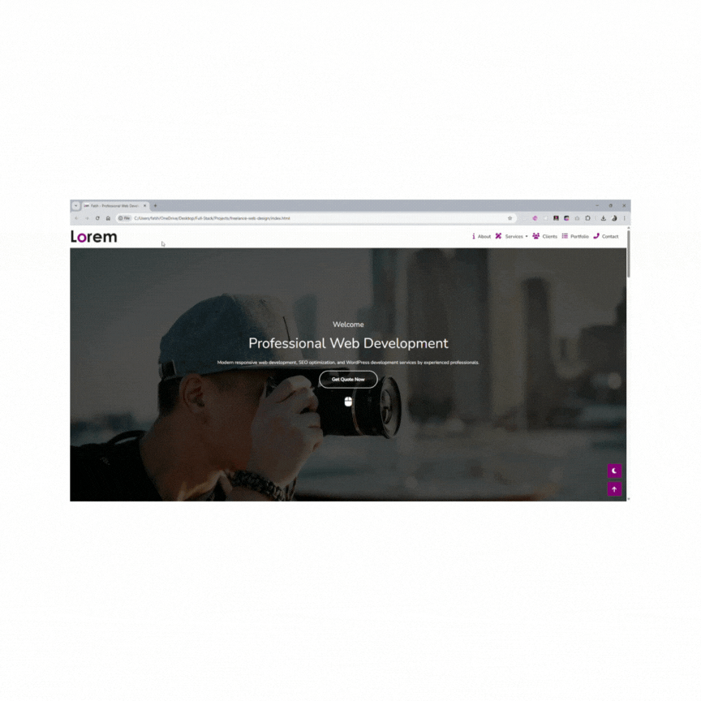

# 🚀 Professional Web Developer Portfolio

A modern, responsive portfolio website showcasing professional web development services.



## 📋 Table of Contents

-   [Overview](#overview)
-   [Features](#features)
-   [Technologies Used](#technologies-used)
-   [Installation](#installation)
-   [Usage](#usage)
-   [Sections](#sections)
-   [SEO Optimization](#seo-optimization)
-   [Browser Support](#browser-support)
-   [Contributing](#contributing)
-   [License](#license)

## 🎯 Overview

This is a professional portfolio website for **Fatih**, a skilled web developer specializing in modern, responsive web solutions. The site showcases services, portfolio projects, client testimonials, and contact information in a clean, user-friendly design.

## ✨ Features

-   **📱 Fully Responsive Design** - Works perfectly on all devices
-   **🎨 Modern UI/UX** - Clean and professional interface
-   **⚡ Fast Loading** - Optimized for performance
-   **🔍 SEO Optimized** - Complete meta tags and structured data
-   **🌐 Cross-browser Compatible** - Works on all modern browsers
-   **📧 Contact Form** - Functional contact form with validation
-   **🎭 Smooth Animations** - CSS transitions and hover effects
-   **📊 Portfolio Gallery** - Categorized project showcase
-   **💬 Client Testimonials** - Social proof section
-   **🔗 Social Media Integration** - Connected social profiles

## 🛠️ Technologies Used

-   **HTML5** - Semantic markup
-   **CSS3** - Modern styling with custom properties
-   **Bootstrap 5** - Responsive framework
-   **Font Awesome 6** - Icon library
-   **Google Fonts** - Nunito font family
-   **JavaScript** - Bootstrap components

## 📦 Installation

1. **Clone the repository**

    ```bash
    git clone https://github.com/fatih/freelance-web-design.git
    ```

2. **Navigate to project directory**

    ```bash
    cd freelance-web-design
    ```

3. **Open in browser**
    ```bash
    # Simply open index.html in your preferred browser
    # Or use a local server
    python -m http.server 8000
    # Then visit http://localhost:8000
    ```

## 🚀 Usage

The website is ready to use out of the box. Simply customize the content:

1. **Update personal information** in `index.html`
2. **Replace images** in the `images/` folder
3. **Modify colors** in `css/style.css` (CSS custom properties)
4. **Update contact details** and social media links

## 📄 Sections

### 🏠 Hero Section

-   Professional introduction
-   Call-to-action button
-   Smooth scroll navigation

### 👨‍💻 About Section

-   Personal introduction
-   Skills and expertise
-   Social media links

### 🛠️ Services Section

-   Web Development
-   Graphic Design
-   SEO Optimization
-   WordPress Development
-   Responsive Design
-   Social Media Integration

### 💼 Portfolio Section

-   Categorized project gallery
-   Interactive filtering
-   Hover effects with project details

### 💬 Testimonials Section

-   Client feedback
-   Professional testimonials
-   Trust building content

### 📞 Contact Section

-   Contact form
-   Phone and email information
-   WhatsApp integration
-   Location details

## 🔍 SEO Optimization

The website includes comprehensive SEO optimization:

-   **Meta Tags** - Title, description, keywords
-   **Open Graph** - Social media sharing optimization
-   **Twitter Cards** - Twitter sharing optimization
-   **Favicon** - Multiple sizes for all devices
-   **Semantic HTML** - Proper heading structure
-   **Alt Tags** - All images have descriptive alt text
-   **Schema Markup Ready** - Structured data friendly

## 🌐 Browser Support

-   ✅ Chrome (latest)
-   ✅ Firefox (latest)
-   ✅ Safari (latest)
-   ✅ Edge (latest)
-   ✅ Mobile browsers

## 📱 Responsive Breakpoints

-   **Mobile**: < 576px
-   **Tablet**: 576px - 768px
-   **Desktop**: > 768px
-   **Large Desktop**: > 1200px

## 🎨 Color Scheme

```css
:root {
    --renk1: rgb(134, 1, 116); /* Primary Purple */
    --renk2: rgba(134, 1, 116, 0.849); /* Primary Purple Alpha */
    --renk3: rgb(144, 144, 144); /* Gray */
    --renk4: rgb(211, 211, 211); /* Light Gray */
    --renk5: rgb(37, 37, 37); /* Dark Gray */
}
```

## 📁 Project Structure

```
freelance-web-design/
├── css/
│   └── style.css
├── images/
│   ├── about.jpeg
│   ├── header-bg.jpeg
│   ├── logo.png
│   ├── user-1.jpeg
│   ├── work-1.jpeg
│   ├── work-2.jpeg
│   ├── work-3.jpeg
│   ├── work-4.jpeg
│   ├── work-5.jpeg
│   ├── work-6.jpeg
│   └── freelancer.gif
├── index.html
└── README.md
```

## 🤝 Contributing

1. Fork the project
2. Create your feature branch (`git checkout -b feature/AmazingFeature`)
3. Commit your changes (`git commit -m 'Add some AmazingFeature'`)
4. Push to the branch (`git push origin feature/AmazingFeature`)
5. Open a Pull Request

## 📄 License

This project is licensed under the MIT License - see the [LICENSE](LICENSE) file for details.

## 🙏 Acknowledgments

-   Bootstrap team for the amazing framework
-   Font Awesome for the icon library
-   Google Fonts for typography
-   Unsplash for placeholder images

---

⭐ **Star this repository if you found it helpful!**

Made with ❤️ by [Fatih](https://github.com/fatih)
